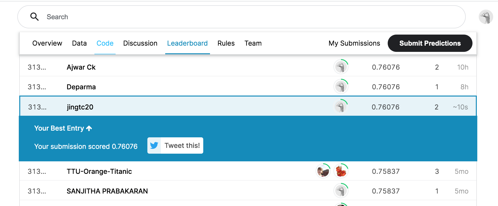
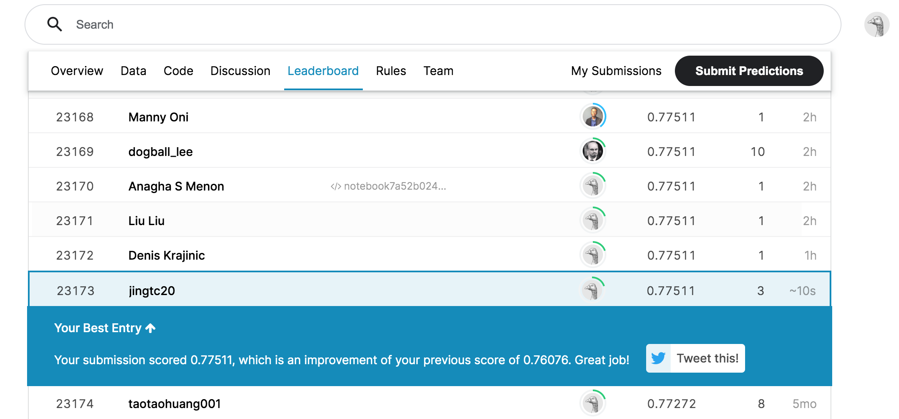

# Predict Survival on the Titanic Disaster
Build a model that predicts which passengers survived the Titanic shipwreck using passenger data, and achieve an accuracy of 77.5% on the test data in Kaggle.

## Problem description
The problem is to study the passengers' lives of the Titanic shipwreck on April 15, 1912. Given some information of 891 passengers on the training data and the result of whether they survived or not, we need to predict whether the other 418 passengers on board survived on the test data.

## Data analysis
- Convert categorical data to numerical form: for train and test data, we can replace `Sex` with numerical data which 0 means male and 1 means female.
- Create useful features: we can combine `SibSp` and `Parch` to create a new variable called `Relative`.
- Deal with missing values: we need to fill missing values of `age` in both train and test data by ramdom value generated by normal distribution in the data. 
- Do data normalization on the train and test data: we should use minmaxscaler instead of standard scalar in both train data and test data, since standard scalar will cause some values hard to interpret, e.g., negative ages

## Result in Kaggle
- Accuracy on the test data using logistic model:  **76.076%**

- Accuracy on the test data using random forest model: **77.511%**   

## Conclusion about the findings
I use five features: Pclass, Sex, Age, Fare, and Relative in the train data and test data. According to my analysis, it can be concluded that in the Titanic shipwreck, female are more likely to susvive than male, people in first class or second class are more likely to susvive than people in third class, children are more likely to susvive than other people, people with more relatives are more likely to susvive than other people, people with higher fare more likely to susvive than people with lower fare.

